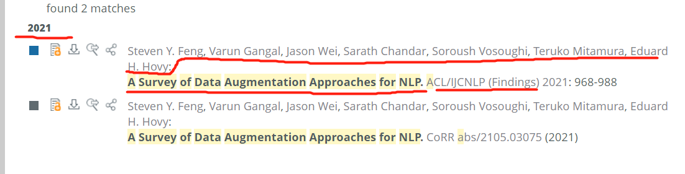

# 第一步做什么

1. 按要求的日期去公众号和网址合集中搜索综述论文
   <div align="center"> <br> 图1 公众号中提及综述的文章 </div>
   如图1所示，发现该公众号有一篇《注意力机制》综述的论文，点击进入该文章找到论文名字。

   

2. 在**新收集.xlsx**中填入除最后一列之外的其他列信息
   先在[dblp](https://dblp.org/) 中根据论文名字找到具体的论文信息填入 **新收集.xlsx** excel表格中，dblp没有再在 [arxiv](https://arxiv.org/search/)中找；表格中汇总这列需要添入的是论文的类别，我们在 **新收集.xlsx** 中类别sheet里可以看到所有的类别

    > 在 **第一步-示例.xlsx** 中可以看到详细的注意事项说明		

   <div align="center" style="padding-top:10px;margin-bottom:10px;"> <br> 图2 dblp上找到综述文章信息(有期刊会议信息，其中CoRR是指arxiv) </div>
   <div align="center"> <br> 图3 arxiv上找到综述文章信息(缺少期刊会议信息) </div>

   **注意事项：**

   - 期刊会议填入缩写即可

   - 汇总这列无法判断就空着，之后学长会来填。

   - 该论文需要是新收集的，已经收集过的就不用收集了(收集过的论文信息都在 **survey.xlsx** 中)。

   - 论文链接如果有多个填入最新的链接。

   - 论文如果是期刊会议，则用对应的时间；否则有多个时间用最早的时间。

   - 一个paper可以有多个类别，如 **第一步-示例.xlsx** 所示的例子一样将该论文信息填写两次。

   - 没有找到论文来源，标记为来源不明并标红

     

3. 在学长填好汇总这一列后，再填写引用
   1. 如图4所示，按照格式在引用这一栏添加路径：/bib/大分类/小分类/作者姓氏+年份+文章首个单词.md。
      
       <div align="center"> <br> 图4 引用内容 </div>
       
   2. 如图5所示，在bib文件夹对应的路径下，新建刚刚命名的Xiao2021A.md文件。
       <div align="center"> <br> 图5 文件夹新建md文件 </div>
       
       如果发现文件名同名，如图6、7所示；我们按照规则(无、1、2、3、...)给文件名后面加数字，并将excel表格引用这列的内容也做修改。
       
       <div style="float:left;margin-right:60px;margin-left:130px;"> <br> <center>图6 文件名冲突解决方法</center> </div>
       <div> <br> <center>图7 解决冲突时，excel也要修改</center> </div>
       
   3. 在[dblp](https://dblp.org/)上面查询该文章的bib，点击下图中的BibTex链接，将内容复制粘贴到刚刚创建的md文件中。
   	<div align="center" style="margin-bottom:10px;"> <br> 图8 BibTex链接点击之后出现的内容 </div>
      <div align="center"> <br> 图9 md文件中的内容 </div>

   	**注意事项：**

   	- 注意图9中画红线的地方，我们需要将 *@article{* 后面的内容手动修改成作者姓氏+年份+文章首个单词（即和md文件名字保持一致)。
      - 如果[dblp](https://dblp.org/)中没有找到文章的bib，去arxiv、 google学术、 百度学术等其他渠道中找；如果依然没有找到，则将excel表格中该行标红。
      - 如图9所示，不要忘记开头和结尾的```


### 公众号和网址合集

- AINLP
- 深度学习这件小事
- AI科技评论
- PaperWeekly
- AI科技大本营
- 专知
- 机器之心
- 深度学习与NLP
- 深度学习自然语言处理
- 机器学习算法与Python学习
- 夕小瑶的卖萌屋
- 香侬科技
- MT论文列表：http://paperreading.club/category?cate=NMT
- 新智元
- arXivDaily
- 机器学习算法与自然语言处理
- https://github.com/thunlp/SOS4NLP （根据清华搜集的论文，找一找我们没有的论文）
- 炼丹笔记
- 李rumor
- NLP工作站
- 机器学习与推荐算法
- AI有道
- 爱可可爱生活