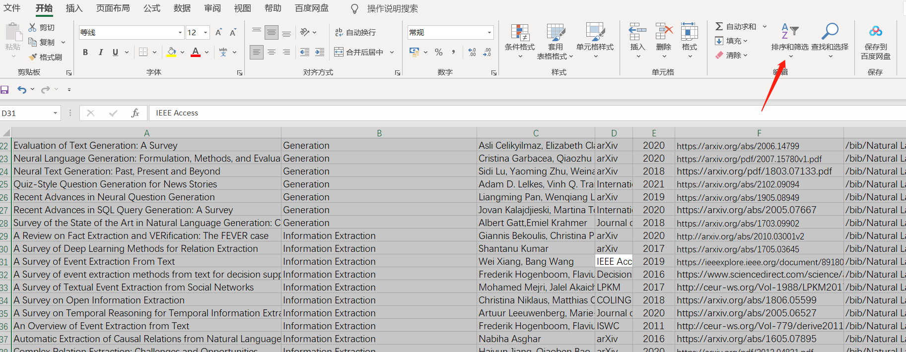
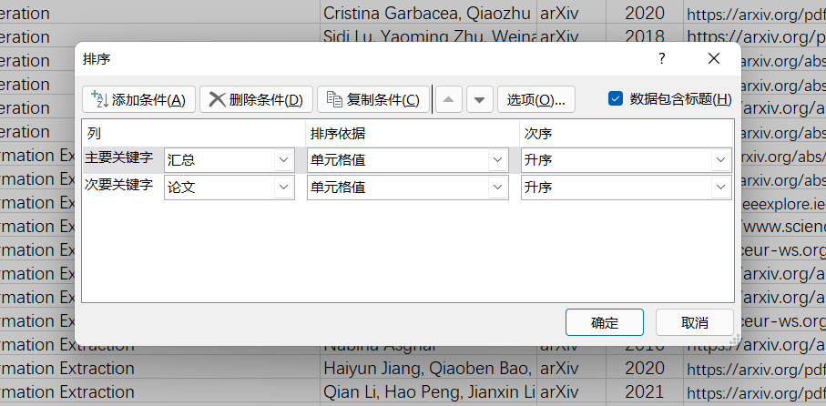

# 第二步做什么

1. 备份旧的survey.xlsx 并将在**新收集.xlsx**中的新论文人工加入survey.xlsx 中
2. 执行 check.py 检查excel中的论文信息和dblp检索到的论文信息是否一致，并进行手动修改
3. 执行 unrepeat.py 根据输出结果手动删除同名论文
4. 对excel进行排序
   
   图1 先全选整个excel表格 

   
   图2 根据如图所示的规则进行排序 

5. 执行 bib-excel-check.py 对excel表格中错误的bib信息进行检测，然后人工修改